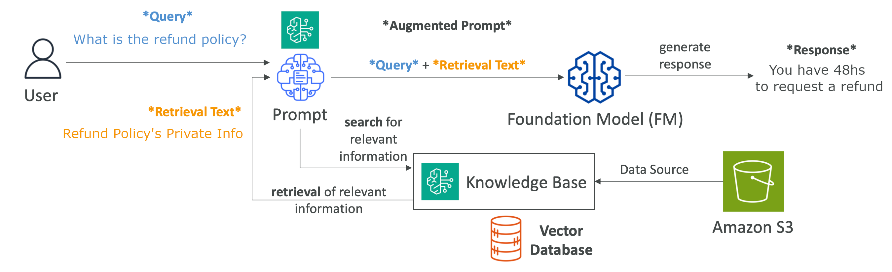
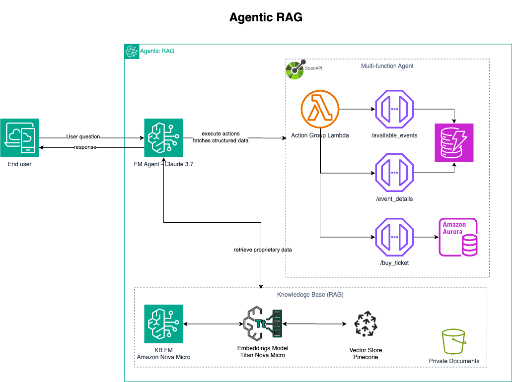

# AnyTicket GenAI Chatbot – AWS Bedrock & Agentic RAG (Production-Ready Use Case)

Welcome to the **AnyTicket AI Support Assistant** project, a robust, production-grade Generative AI solution designed to revolutionize event ticketing interactions. Addressing the limitations of static knowledge bases, this project leverages **AWS Bedrock and cutting-edge Agentic Retrieval-Augmented Generation (RAG)** to provide a dynamic, **24/7** conversational experience.

Unlike conventional RAG systems that offer single-turn answers, the AnyTicket AI Support Assistant demonstrates the power of autonomous AI agents capable of orchestrating complex, multi-step user journeys. For instance, users can seamlessly inquire about events on a specific date, receive detailed information about their chosen event, and then directly proceed to purchase tickets—all within a fluid, natural conversation. This solution showcases advanced cloud architecture, secure infrastructure-as-code (IaC), and real-world GenAI application development, highlighting how Agentic RAG can drive sophisticated, task-oriented automation in complex domains.

## The Evolution of Generative AI: From RAG to Agentic RAG

### Understanding Retrieval Augmented Generation (RAG)

#### What is RAG? Extending LLM Capabilities with Enterprise Data

Large Language Models (LLMs) possess extensive knowledge, yet their inherent information is static, limited to their training data's last update. **Retrieval Augmented Generation (RAG) introduces a critical architectural advancement, enabling LLMs to dynamically access, comprehend, and synthesize information from external, proprietary knowledge bases.** This empowers LLMs to move beyond generic responses, providing accurate, contextual, and verifiable insights drawn directly from an organization's specific domain data. RAG transforms LLMs into precise knowledge engines, injecting highly relevant context into their reasoning processes, thereby significantly enhancing factual accuracy and reducing inferential inaccuracies.

#### Strategic Advantages of RAG for Enterprise AI

- **Ensure Data Currency:** Provide LLMs with the most current organizational information.
- **Mitigate Hallucinations:** Anchor LLM outputs in verified facts from enterprise data, preventing the generation of incorrect or fabricated information.
- **Leverage Proprietary Knowledge:** Integrate confidential documents and internal databases for actionable intelligence.
- **Cost-Efficient Scaling:** Achieve superior domain-specific accuracy and relevance significantly more cost-effectively than fine-tuning or retraining large language models.

#### Key Use Cases for RAG Implementations

- **Customer Support Automation:** Power chatbots with comprehensive product guides, troubleshooting FAQs, and internal service policies for instant, accurate customer assistance.
- **Financial Advisory & Compliance:** Augment financial models and compliance systems with real-time market data, regulatory updates, and proprietary investment research for precise recommendations and adherence.
- **Legal & Regulatory Research:** Enable rapid retrieval and synthesis of laws, case precedents, and internal legal opinions for in-depth analysis and expedited decision-making.
- **Healthcare Decision Support:** Provide clinicians and researchers with on-demand access to medical guidelines, patient records, and the latest research papers for informed diagnostic and treatment pathways.
- **Internal Knowledge Management:** Centralize and democratize access to internal documentation, HR policies, and project histories, empowering employees with instant answers to operational queries.

### Advancing Autonomous AI Systems: The Power of Agentic RAG

While conventional RAG augments LLMs with retrieved context, **Agentic RAG signifies a transformative evolution, enabling LLMs to function as autonomous, problem-solving entities.** This architectural paradigm extends beyond simple question-answering, leveraging intelligent agents that reason, plan, and execute multi-step operations.

For instance, this project's **AnyTicket AI Support Assistant** demonstrates how agents can orchestrate complex workflows. Instead of a single query-response, the agent intelligently guides the user through a multi-turn conversation: from discovering available events on a specific date, to providing detailed information about a chosen event, and finally, facilitating the purchase of a ticket—all within a fluid, natural conversation. This showcases Agentic RAG's power to automate intricate processes and deliver comprehensive, task-oriented solutions.

## 🚀 Executive Summary

- **Business Value:**
  - 24/7 intelligent customer support for event ticketing, reducing operational costs and improving customer satisfaction.
  - Secure, scalable, and compliant by design—ready for real-world enterprise workloads.
- **Solution Highlights:**
  - Modern GenAI patterns, multi-turn conversation, and contextual Q&A from unstructured data.
  - End-to-end security, observability, and automation using AWS best practices.

---

## 🏗️ Solution Overview

- **Domain:** Event ticketing (AnyTicket)
- **Use Case:** AI-powered, multi-turn customer support chatbot
- **Cloud Platform:** AWS (Bedrock, Lambda, API Gateway, CloudFront, WAF, VPC, S3, IAM, etc.)
- **IaC:** 100% managed via Terraform (modular, reusable, and production-ready)
- **Frontend:** Minimal Streamlit demo for API showcase (decoupled from backend)

---

## 🌟 Key Differentiators

- **Production-Ready by Design:**
  - Security, scalability, and compliance are built-in—not afterthoughts.
  - Automated deployment, monitoring, and guardrails for safe GenAI adoption.
- **AWS Well-Architected Framework Alignment:**
  - [AWS Well-Architected Framework](https://aws.amazon.com/architecture/well-architected/) principles:
    - **Operational Excellence:** Logging and monitoring.
    - **Security:** WAF, API keys, IAM least privilege, Bedrock Guardrails, prompt injection protection.
    - **Reliability:** Multi-AZ VPC, reserved Lambda concurrency, API Gateway throttling.
    - **Performance Efficiency:** Serverless, auto-scaling, and global CDN (CloudFront).
    - **Cost Optimization:** Pay-as-you-go, no idle resources, and efficient resource sizing.
- **Real-World Patterns:**
  - Multi-turn conversation, session management, secure prompt engineering, and content safety.
  - Modular IaC for rapid adaptation to new domains or data sources.

---

## 🛡️ Security & Compliance Highlights

- **Defense-in-Depth:**
  - AWS WAF, CloudFront, and API Gateway for layered protection.
  - Lambda authorizer for API key validation and origin verification.
  - Bedrock Guardrails for content safety and compliance.
- **Data Privacy:**
  - No PII leakage—prompt template and RAG output are strictly controlled.
  - All secrets managed via environment variables and SSM Parameter Store.
- **Audit & Observability:**
  - CloudWatch logging for API, Lambda, and WAF events.
  - Modular observability stack for production monitoring.

---

## 🧩 Architecture Diagram

See [`iac/README.md`](iac/README.md) for detailed architecture diagrams:

- API Communication & Security
- Networking & VPC

---

## 🛠️ High-Level Architecture

- **Frontend:** Streamlit demo (for portfolio/demo only)
- **API Layer:**
  - Amazon API Gateway (HTTP API, Lambda Proxy integration)
  - Custom Lambda Authorizer (API key & origin verification)
- **Application Logic:**
  - AWS Lambda (Python, Bedrock Knowledge Base integration)
  - Bedrock RAG with secure prompt engineering
- **Data & Knowledge Base:**
  - Bedrock Knowledge Base (S3, Pinecone, OpenSearch, etc. supported)
  - No database required for session state (handled by Bedrock)
- **Networking & Security:**
  - VPC, private subnets, NAT Gateway, security groups
  - AWS WAF, CloudFront (global CDN, DDoS protection)
- **Observability:**
  - CloudWatch logs, metrics, and alarms
- **IaC:**
  - Modular Terraform (see `iac/` and submodules)

---

## 📦 Project Structure

- `src/` — Lambda source code (chatbot, authorizer)
- `iac/` — Infrastructure as Code (Terraform modules, diagrams, docs)
- `streamlit_demo/` — Minimal frontend for API demo
- `tests/` — Unit and integration tests

---

## 📝 Key Features & Implementation Details

- **Multi-turn Conversation:**
  - Session management via Bedrock (no DB required)
- **Prompt Security:**
  - User input wrapped in `<nonce>`, RAG output in `<KB>`
  - Prevents prompt injection and data leakage
- **Content Safety:**
  - Bedrock Guardrails, WAF, and profanity filters
- **API Security:**
  - API key, origin verification, and Lambda authorizer
- **IaC Best Practices:**
  - Modular, reusable, and environment-agnostic
- **Observability:**
  - CloudWatch logs for API, Lambda, and WAF

---

## 👩‍💻 Technical Deep Dive

- **Terraform modules** for Bedrock, Lambda, API Gateway, WAF, VPC, and more
- **Production patterns:**
  - Lambda reserved concurrency, API throttling, VPC isolation
  - Secure environment variable and secret management
- **Extensible:**
  - Add new data sources, models, or domains with minimal changes
- **Testing:**
  - Unit and integration tests for backend logic

---

## 📈 Business & Domain Impact

- **GenAI for Customer Support:**
  - Automates and enhances customer support for event ticketing
  - Reduces support costs, improves response times, and scales with demand
- **Modern Cloud Skills:**
  - Demonstrates AWS, GenAI, and security best practices
  - IaC, serverless, and production-readiness
- **Compliance & Trust:**
  - Built-in guardrails for privacy, safety, and regulatory needs

---

## 📚 Further Reading & Diagrams

- See [`iac/README.md`](iac/README.md) for deep dives into:
  - API security architecture
  - Networking and VPC design
  - Terraform module documentation
- [AWS Well-Architected Framework](https://aws.amazon.com/architecture/well-architected/)

---

## 🏁 Quickstart & Developer Setup

1. **Install prerequisites:**
   - Terraform, terraform-docs, Python 3.11+, Node.js 18+, Rust
2. **Clone the repo & set up environment variables**
3. **Build & deploy infrastructure:**
   - See `iac/README.md` for details
4. **Run the Streamlit demo:**
   - See `streamlit_demo/README.md` (if present)

---

## 📝 Notes

- Uses [AWS Lambda Powertools](https://awslabs.github.io/aws-lambda-powertools-python/latest/) for logging, metrics, and tracing
- All code and infra are production-ready and modular for real-world use
- For questions or collaboration, please reach out!
