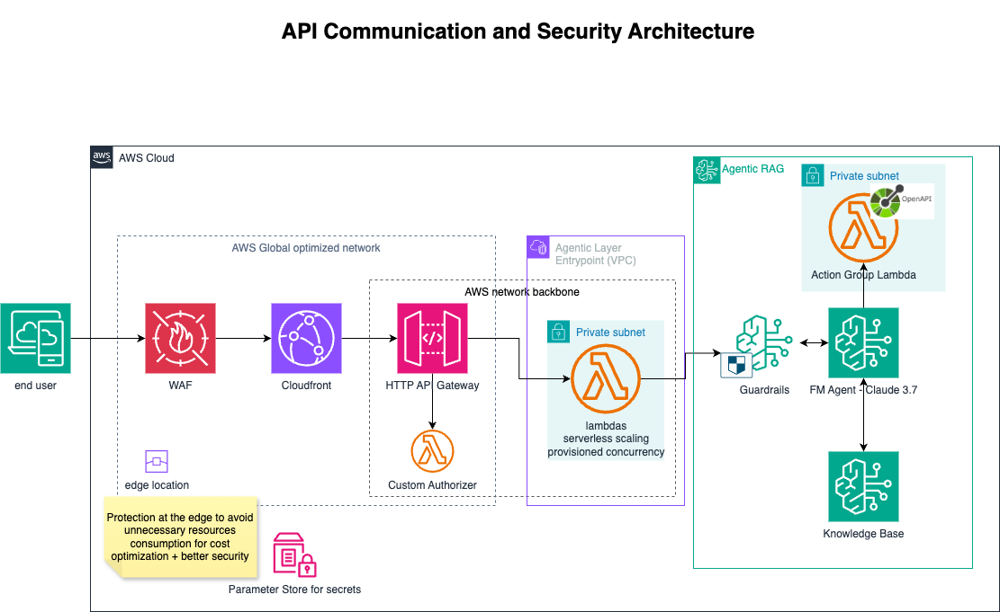

# 🤖 AnyTicket GenAI Chatbot – AWS Bedrock & Agentic RAG (Production-Ready Use Case)

Welcome to the **AnyTicket AI Support Assistant** project. This **demonstration** showcases the power of building a robust, production-ready Generative AI solution designed to revolutionize event ticketing interactions. Addressing common challenges like outdated static FAQ pages and the scalability constraints of human support, it leverages **AWS Bedrock and cutting-edge Agentic Retrieval-Augmented Generation (RAG)** to provide a dynamic, **24/7** conversational experience that boosts efficiency and user satisfaction.

Unlike conventional RAG systems that offer single-turn answers, the AnyTicket AI Support Assistant demonstrates the power of autonomous AI agents capable of orchestrating complex, multi-step user journeys. For instance, users can seamlessly inquire about events on a specific date, receive detailed information about their chosen event, and then directly proceed to purchase tickets—all within a fluid, natural conversation. This solution showcases advanced cloud architecture, secure infrastructure-as-code (IaC) with Terraform, and real-world GenAI application development, highlighting how Agentic RAG can drive sophisticated, cost-efficient, task-oriented automation in complex domains.

## The Evolution of Generative AI: From RAG to Agentic RAG

### 📚 Understanding Retrieval Augmented Generation (RAG)

#### What is RAG? Extending LLM Capabilities with Enterprise Data

Large Language Models (LLMs) possess extensive knowledge, yet their inherent information is static, limited to their training data's last update. **Retrieval Augmented Generation (RAG) introduces a critical architectural advancement, enabling LLMs to dynamically access, comprehend, and synthesize information from external, proprietary knowledge bases.** This empowers LLMs to move beyond generic responses, providing accurate, contextual, and verifiable insights drawn directly from an organization's specific domain data. RAG transforms LLMs into precise knowledge engines, injecting highly relevant context into their reasoning processes, thereby significantly enhancing factual accuracy and reducing inferential inaccuracies.

#### Strategic Advantages of RAG for Enterprise AI

- **Ensure Data Currency:** Provide LLMs with the most current organizational information.
- **Mitigate Hallucinations:** Anchor LLM outputs in verified facts from enterprise data, preventing the generation of incorrect or fabricated information.
- **Leverage Proprietary Knowledge:** Integrate confidential documents and internal databases for actionable intelligence.
- **Cost-Efficient Scaling:** Achieve superior domain-specific accuracy and relevance significantly more cost-effectively than fine-tuning or retraining large language models.

#### Key Use Cases for RAG Implementations

- **Customer Support Automation:** Power chatbots with comprehensive product guides, troubleshooting FAQs, and internal service policies for instant, accurate customer assistance.
- **Financial Advisory & Compliance:** Augment financial models and compliance systems with real-time market data, regulatory updates, and proprietary investment research for precise recommendations and adherence.
- **Legal & Regulatory Research:** Enable rapid retrieval and synthesis of laws, case precedents, and internal legal opinions for in-depth analysis and expedited decision-making.
- **Healthcare Decision Support:** Provide clinicians and researchers with on-demand access to medical guidelines, patient records, and the latest research papers for informed diagnostic and treatment pathways.
- **Internal Knowledge Management:** Centralize and democratize access to internal documentation, HR policies, and project histories, empowering employees with instant answers to operational queries.

### 🦄 Advancing Autonomous AI Systems: The Power of Agentic RAG

While conventional RAG augments LLMs with retrieved context, **Agentic RAG signifies a transformative evolution, enabling LLMs to function as autonomous, problem-solving entities.** This architectural paradigm extends beyond simple question-answering, leveraging intelligent agents that reason, plan, and execute multi-step operations.

For instance, this project's **AnyTicket AI Support Assistant** demonstrates how agents can orchestrate complex workflows. Instead of a single query-response, the agent intelligently guides the user through a multi-turn conversation: from discovering available events on a specific date, to providing detailed information about their chosen event, and finally, facilitating the purchase of a ticket—all within a fluid, natural conversation. This showcases Agentic RAG's power to automate intricate processes and deliver comprehensive, task-oriented solutions.

## 🏗️ High-Level Architecture

- **Frontend:** Streamlit demo (for portfolio/demo only)
- **API Layer:**
  - Amazon API Gateway (HTTP API, Lambda Proxy integration **for scalable, managed entry point**)
  - Custom Lambda Authorizer (**ensures robust API key & origin verification for secure access**)
- **Application Logic & Agent Orchestration:**
  - AWS Lambda (Python, serving as the orchestrator for Bedrock Agents and other services)
  - **Amazon Bedrock Agents:** Drives multi-turn conversations and complex task execution. Manages session state directly (no separate database needed) and leverages tools for actions.
- **Data & Knowledge Base:**
  - Bedrock Knowledge Base (backed by S3, supports various data sources like Pinecone, OpenSearch, etc.)
  - Secure prompt engineering applied at the Bedrock layer (guiding Agent behavior and content safety)
- **Networking & Security:**
  - **AWS WAF (Layer 7 protection at the edge), CloudFront (API acceleration, DDoS protection)**
  - VPC, private subnets, NAT Gateway, **NACL**, security groups (for secure and isolated networking)
- **Observability:**
  - CloudWatch logs, metrics, and alarms (for comprehensive operational insight)
- **IaC:**
  - Modular Terraform (ensuring repeatable, scalable, and auditable infrastructure deployment)

---

## 🚀 Architecting for Scale: Reusability and Integration Capabilities

Unlocking enterprise value through versatile Generative AI integration.

### 🧭 Amazon Bedrock Knowledge Bases: Flexible Integration Points

Amazon Bedrock Knowledge Bases are designed for broad reusability and seamless integration across diverse applications:

- **API-oriented Solution:** Knowledge Bases can be exposed as an API, powering a wide array of applications, from internal, company-dedicated solutions to external-facing SaaS products, enabling scalable and secure access to your proprietary data.
- **Foundation for Bedrock Agents:** Beyond direct querying, Knowledge Bases serve as a foundational data source for Bedrock Agents, enabling them to retrieve contextually rich information necessary for building complex, multi-step conversational flows and automated tasks.
- **Direct MCP Integration:** Through [MCP](https://awslabs.github.io/mcp/servers/bedrock-kb-retrieval-mcp-server/), developers can query Knowledge Bases from various Integrated Development Environments (IDEs) such as Cursor or VSCode, or via the AWS Q CLI. This also enables building **custom internal tools** that allow product managers or data analysts to directly explore, validate, or audit specific private data points within the knowledge base, offering quick factual lookups outside of a conversational AI.

### 🤖 Amazon Bedrock Agents: Orchestrating Advanced Workflows

Amazon Bedrock Agents offer powerful reusability and collaboration patterns for complex automation:

- **Agent Flow as an API:** Individual Agent workflows can be exposed as APIs, providing powerful, task-oriented capabilities that can be consumed by other applications or services, whether for internal automation or as part of a public-facing product.
- **Multi-Agent Collaboration:** For highly complex tasks, Amazon Bedrock Agents supports advanced multi-agent collaboration. A designated **Supervisor Agent** orchestrates sophisticated workflows by intelligently delegating specific sub-tasks to specialized **Collaborator Agents**. This modular approach allows for breaking down intricate problems, leveraging distinct areas of expertise, and seamlessly combining results to achieve comprehensive, automated solutions.

---

## 💯 Building Robust AI Applications at Scale: A Well-Architected Approach

Building production-grade Generative AI applications requires a strong architectural foundation. The AWS Well-Architected Framework provides essential guidance for achieving these goals. This project rigorously applies its principles, making it truly prepared for large-scale, real-world deployment.

**Key Pillars for Production-Ready AI:**

- **Operational Excellence:** Logging and monitoring (e.g., Model Invocation Logs, VPC Flow Logs) for continuous improvement and efficiency.
- **Security:** Multi-layered protection with AWS WAF on top of CloudFront for protection at the edge, complemented by API keys, IAM least privilege, restrict networking firewall rules (NACL/SG), Bedrock Guardrails, and prompt injection defenses.
- **Reliability:** High availability and fault tolerance via Multi-AZ VPC (with multiple NATs), reserved Lambda concurrency, API Gateway throttling, and Cross-Region Inference Profiles for enhanced resilience and throughput across geographies.
- **Performance Efficiency:** Optimized resource utilization with serverless architecture, Lambda Provisioned Concurrency and Auto-Scaling for consistent low-latency responses, and global CDN (CloudFront).
- **Cost Optimization:** Efficient resource sizing, pay-as-you-go models, Cost Allocation Tags for effective cost tracking, and effective Foundation Model selection strategy as we need 2 FM in this use-case _(one for the KB, and another for the Agent)_.

This project's core architecture exemplifies these principles, particularly in its robust API communication and comprehensive security framework—critical aspects for any Generative AI solution operating at scale.

### 🛡️ API Communication and Security Architecture

This architecture follows a defense-in-depth model to provide a secure and globally accelerated entry point for the application's API. Its design focuses on protecting traffic at the network edge, accelerating user requests via the AWS global backbone, and decoupling the API endpoint layer from the core Agentic RAG processing logic.

The request flow and key components are:

- **AWS WAF:** Provides a defense-in-depth, Layer 7 firewall at the network edge. It inspects incoming requests with a prioritized, multi-layered strategy, optimized for efficiency and performance _(managing WAF Capacity Units (WCU) to balance the computational cost of complex rules with their security benefits and the need for low-latency traffic inspection)_.

- **IP & Rate Limiting:** Immediately blocks known malicious IPs (`AmazonIpReputationList`) and provides automated protection against brute-force and DDoS attacks using a `RateLimitRule`.
- **Threat Signature Matching:** Utilizes AWS Managed Rule Sets to block requests from anonymous proxies (`AnonymousIpList`), known exploit patterns (`KnownBadInputsRuleSet`), and common web attacks defined in the OWASP Top 10 (`CoreRuleSet`).

- **Amazon CloudFront:** It **accelerates API performance** by routing users to the nearest edge location and utilizes the AWS global backbone to communicate with the origin. It is configured to be the **only** entry point to the API Gateway to enhance security.

- **API Gateway _(HTTP API)_:** Serves as the managed, regional entry point for our backend. It handles request validation, throttling, and routing. Access to the API Gateway is locked down and verified by a **custom Lambda Authorizer**, which performs two critical checks:

  1.  It validates a secret `X-Origin-Verify` header to ensure the request is from our CloudFront distribution.
  2.  It validates the client-provided `x-api-key` required for API access.

- **AWS Lambda:** The function is invoked synchronously by API Gateway and runs within our private VPC.

  - **Availability and Performance Efficiency:** To ensure responsiveness during traffic spikes and protect downstream resources, the key functions are configured with **reserved concurrency** and **provisioned concurrency**.
  - **Dependency Management:** Common libraries and dependencies are managed using **Lambda Layers** to promote code re-use, better organization, and smaller deployment package sizes.

- **Guardrails:** To **prevent PII leakage**, filter harmful content, and block undesirable topics, both FMs uses Guardrails to enhance safety and privacy.

- **Secure Prompt Engineering:** The prompts are designed with a safety-first approach leveraging industry best-practices to prevent prompt injections.

- **Parameter Store:** Simplest approach to safely store all project's secrets

- **S3:** Stores **company's private data** with Restricted Resource Policies for Knowledge Base-only access, leveraging **SSE-KMS with Bucket Keys enabled** for enhanced key control, auditable access tracking by security teams, and cost optimization.

### 🌐 Networking Architecture

The diagram below illustrates the networking components provisioned by the infrastructure code. While networking is not the main focus of this repository, it demonstrates production-grade VPC design and AWS best practices.

---

## 👩‍💻 Getting Started & Project Overview

### Quickstart

1. **Install prerequisites:**
   - Terraform, terraform-docs, Python 3.11+, Node.js 18+, Rust
2. **Clone the repo & set up environment variables**
3. **Build & deploy infrastructure:**
   - See `iac/README.md` for details
4. **Run the Streamlit demo:**
   - See `streamlit_demo/README.md` (if present)

### Project Structure

- `src/` — Lambda source code (chatbot, authorizer)
- `iac/` — Infrastructure as Code (Terraform modules, diagrams, docs)
- `streamlit_demo/` — Minimal frontend for API demo
- `tests/` — Unit and integration tests

### Key Technologies & Notes

- Uses [AWS Lambda Powertools](https://awslabs.github.io/aws-lambda-powertools-python/latest/) for logging, metrics, and tracing.
