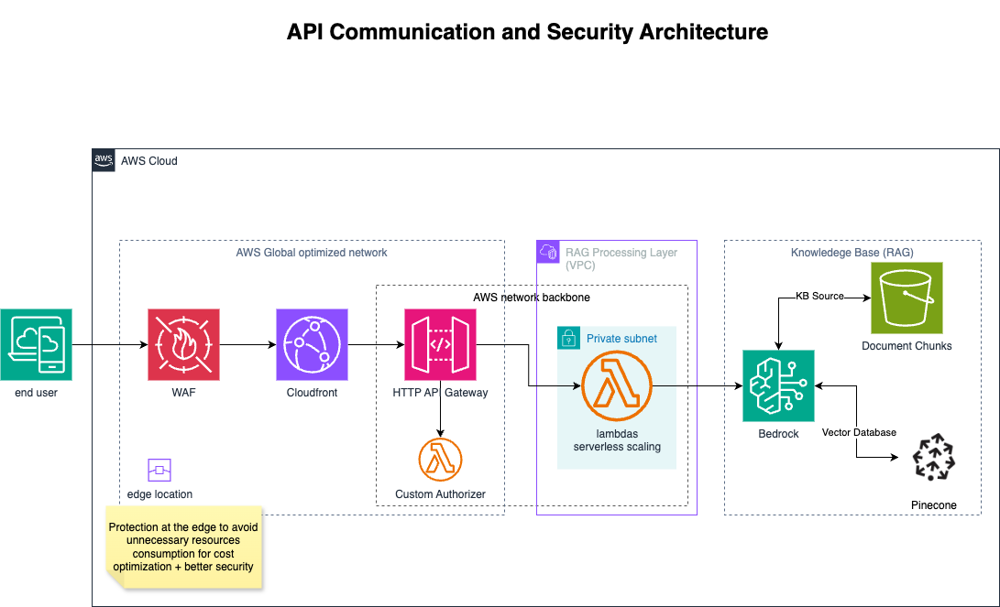

# Developer Notes

- You have to request access for the bedrock models used in the project in the region you're intended to deploy it
- The backend configuration (`backend.tf`) is **not committed** to version control. Each developer should create their own `backend.tf` or use CLI flags for backend settings.
- The AWS provider uses variables for `region` and `profile`. You can set these via:
  - CLI:
    `terraform plan -var="aws_profile=your_profile" -var="aws_region=us-east-2"`
  - Environment variables (before running any terraform cli command):
    `export AWS_PROFILE=your_profile`
    `export AWS_REGION=us-east-2`
- If `aws_profile` is not set, Terraform will use your default AWS CLI profile.
- Create a `local.auto.tfvars` and fill it based on the [variables.tf](variables.tf) file.
- Update the [vpc.tf](vpc.tf) file based on the region you're intended to use
- Run export AWS_ACCESS_KEY_ID=<ci_principal_arn access-key> && export AWS_SECRET_ACCESS_KEY=<ci_principal_arn secret> in terminal before run any terraform command

## API Communication and Security Architecture

This architecture follows a defense-in-depth model to provide a secure and globally accelerated entry point for the application's API. Its design focuses on protecting traffic at the network edge, accelerating user requests via the AWS global backbone, and decoupling the API endpoint layer from the core RAG processing logic.

The request flow and key components are:

- **AWS WAF:** Provides a defense-in-depth, Layer 7 firewall at the network edge. It inspects incoming requests using a prioritized, multi-layered strategy:

  - **IP & Rate Limiting:** Immediately blocks known malicious IPs (`AmazonIpReputationList`) and provides automated protection against brute-force and DDoS attacks using a `RateLimitRule`.
  - **Threat Signature Matching:** Utilizes AWS Managed Rule Sets to block requests from anonymous proxies (`AnonymousIpList`), known exploit patterns (`KnownBadInputsRuleSet`), and common web attacks defined in the OWASP Top 10 (`CoreRuleSet`).

- **Amazon CloudFront:** Acts as the global Content Delivery Network (CDN). It accelerates API performance by routing users to the nearest edge location and utilizes the AWS global backbone to communicate with the origin. It is configured to be the **only** entry point to the API Gateway.

- **Amazon API Gateway (HTTP API):** Serves as the managed, regional entry point for our backend. It handles request validation, throttling, and routing. Access to the API Gateway is locked down and verified by a **custom Lambda Authorizer**, which performs two critical checks:

  1.  It validates a secret `X-Origin-Verify` header to ensure the request is from our CloudFront distribution.
  2.  It validates the client-provided `x-api-key` required for API access.

- **AWS Lambda:** The function is invoked synchronously by API Gateway and runs within our private VPC.
  - **Availability:** To ensure responsiveness during traffic spikes and protect downstream resources, the function is configured with a **reserved concurrency** of 500.
  - **Dependency Management:** Common libraries and dependencies are managed using **Lambda Layers** to promote code re-use, better organization, and smaller deployment package sizes.
  - **Core Logic:** The function's code orchestrates the business logic, making secure calls to the Amazon Bedrock backend to power the RAG assistant.

## Networking Architecture

The diagram below illustrates the networking components provisioned by the infrastructure code. While networking is not the main focus of this repository, it demonstrates production-grade VPC design and AWS best practices.

<!-- BEGIN_TF_DOCS -->

## Requirements

| Name                                                                        | Version  |
| --------------------------------------------------------------------------- | -------- |
|  [archive](#requirement_archive)          | ~> 2.0   |
|  [aws](#requirement_aws)                      | ~>5.0    |
|  [awscc](#requirement_awscc)                | = 1.35.0 |
|  [opensearch](#requirement_opensearch) | 2.2.0    |
|  [time](#requirement_time)                   | ~> 0.6   |

## Providers

| Name                                                                           | Version |
| ------------------------------------------------------------------------------ | ------- |
|  [archive](#provider_archive)                   | 2.7.1   |
|  [aws](#provider_aws)                               | 5.99.1  |
|  [aws.us_east_1](#provider_aws.us_east_1) | 5.99.1  |
|  [random](#provider_random)                      | 3.7.2   |

## Modules

| Name                                                                                   | Source                             | Version |
| -------------------------------------------------------------------------------------- | ---------------------------------- | ------- |
|  [authorizer_lambda](#module_authorizer_lambda) | ./modules/lambda                   | n/a     |
|  [bedrock](#module_bedrock)                               | ./modules/bedrock-components       | n/a     |
|  [chatbot_lambda](#module_chatbot_lambda)          | ./modules/lambda                   | n/a     |
|  [networking](#module_networking)                      | ./modules/networking-components    | n/a     |
|  [observability](#module_observability)             | ./modules/observability-components | n/a     |

## Resources

| Name                                                                                                                                                                                  | Type        |
| ------------------------------------------------------------------------------------------------------------------------------------------------------------------------------------- | ----------- |
| [aws_apigatewayv2_api.chatbot_api](https://registry.terraform.io/providers/hashicorp/aws/latest/docs/resources/apigatewayv2_api)                                                      | resource    |
| [aws_apigatewayv2_authorizer.api_key_authorizer](https://registry.terraform.io/providers/hashicorp/aws/latest/docs/resources/apigatewayv2_authorizer)                                 | resource    |
| [aws_apigatewayv2_integration.chatbot_lambda_integration](https://registry.terraform.io/providers/hashicorp/aws/latest/docs/resources/apigatewayv2_integration)                       | resource    |
| [aws_apigatewayv2_route.chatbot_options_route](https://registry.terraform.io/providers/hashicorp/aws/latest/docs/resources/apigatewayv2_route)                                        | resource    |
| [aws_apigatewayv2_route.chatbot_post_route](https://registry.terraform.io/providers/hashicorp/aws/latest/docs/resources/apigatewayv2_route)                                           | resource    |
| [aws_apigatewayv2_stage.default](https://registry.terraform.io/providers/hashicorp/aws/latest/docs/resources/apigatewayv2_stage)                                                      | resource    |
| [aws_cloudfront_distribution.api_distribution](https://registry.terraform.io/providers/hashicorp/aws/latest/docs/resources/cloudfront_distribution)                                   | resource    |
| [aws_cloudwatch_log_group.api_logs](https://registry.terraform.io/providers/hashicorp/aws/latest/docs/resources/cloudwatch_log_group)                                                 | resource    |
| [aws_cloudwatch_log_group.waf_logs](https://registry.terraform.io/providers/hashicorp/aws/latest/docs/resources/cloudwatch_log_group)                                                 | resource    |
| [aws_lambda_permission.api_gateway_auth_lambda](https://registry.terraform.io/providers/hashicorp/aws/latest/docs/resources/lambda_permission)                                        | resource    |
| [aws_lambda_permission.api_gateway_lambda](https://registry.terraform.io/providers/hashicorp/aws/latest/docs/resources/lambda_permission)                                             | resource    |
| [aws_security_group.lambda_sg](https://registry.terraform.io/providers/hashicorp/aws/latest/docs/resources/security_group)                                                            | resource    |
| [aws_ssm_parameter.api_key](https://registry.terraform.io/providers/hashicorp/aws/latest/docs/resources/ssm_parameter)                                                                | resource    |
| [aws_ssm_parameter.cloudfront_secret](https://registry.terraform.io/providers/hashicorp/aws/latest/docs/resources/ssm_parameter)                                                      | resource    |
| [aws_wafv2_web_acl.application_waf](https://registry.terraform.io/providers/hashicorp/aws/latest/docs/resources/wafv2_web_acl)                                                        | resource    |
| [aws_wafv2_web_acl_logging_configuration.waf_logging](https://registry.terraform.io/providers/hashicorp/aws/latest/docs/resources/wafv2_web_acl_logging_configuration)                | resource    |
| [random_password.api_key](https://registry.terraform.io/providers/hashicorp/random/latest/docs/resources/password)                                                                    | resource    |
| [random_password.cloudfront_secret](https://registry.terraform.io/providers/hashicorp/random/latest/docs/resources/password)                                                          | resource    |
| [archive_file.authorizer_lambda](https://registry.terraform.io/providers/hashicorp/archive/latest/docs/data-sources/file)                                                             | data source |
| [archive_file.chatbot_lambda](https://registry.terraform.io/providers/hashicorp/archive/latest/docs/data-sources/file)                                                                | data source |
| [aws_caller_identity.current](https://registry.terraform.io/providers/hashicorp/aws/latest/docs/data-sources/caller_identity)                                                         | data source |
| [aws_cloudfront_cache_policy.caching_disabled](https://registry.terraform.io/providers/hashicorp/aws/latest/docs/data-sources/cloudfront_cache_policy)                                | data source |
| [aws_cloudfront_origin_request_policy.all_viewer_except_host_header](https://registry.terraform.io/providers/hashicorp/aws/latest/docs/data-sources/cloudfront_origin_request_policy) | data source |
| [aws_region.current](https://registry.terraform.io/providers/hashicorp/aws/latest/docs/data-sources/region)                                                                           | data source |

## Inputs

| Name                                                                                                            | Description                                                   | Type     | Default | Required |
| --------------------------------------------------------------------------------------------------------------- | ------------------------------------------------------------- | -------- | ------- | :------: |
|  [aws_profile](#input_aws_profile)                                              | AWS CLI profile to use                                        | `string` | `null`  |    no    |
|  [aws_region](#input_aws_region)                                                 | AWS region to deploy resources                                | `string` | `null`  |    no    |
|  [bedrock_model_arn](#input_bedrock_model_arn)                            | ARN of the Bedrock model to use for the chatbot Lambda.       | `string` | n/a     |   yes    |
|  [cost_center](#input_cost_center)                                              | The cost center associated with the resources.                | `string` | `null`  |    no    |
|  [created_by](#input_created_by)                                                 | The arn of the IAM user or role that create the resources     | `string` | n/a     |   yes    |
|  [environment](#input_environment)                                              | The environment for the resources (e.g., dev, staging, prod). | `string` | n/a     |   yes    |
|  [kb_storage_type](#input_kb_storage_type)                                  | The storage type of a knowledge base.                         | `string` | `null`  |    no    |
|  [owner](#input_owner)                                                                | The owner of the resources.                                   | `string` | n/a     |   yes    |
|  [pinecone_connection_string](#input_pinecone_connection_string) | The endpoint URL for your index management page.              | `string` | `null`  |    no    |
|  [project](#input_project)                                                          | The project name for the resources.                           | `string` | n/a     |   yes    |

## Outputs

| Name                                                                                                                                                     | Description                                                        |
| -------------------------------------------------------------------------------------------------------------------------------------------------------- | ------------------------------------------------------------------ |
|  [api_endpoint](#output_api_endpoint)                                                                                  | API Gateway endpoint URL for the default stage                     |
|  [api_execution_arn](#output_api_execution_arn)                                                                   | API Gateway execution ARN                                          |
|  [api_id](#output_api_id)                                                                                                    | API Gateway ID                                                     |
|  [api_key](#output_api_key)                                                                                                 | API Key for accessing the Chatbot API (sensitive)                  |
|  [bedrock_data_source_id](#output_bedrock_data_source_id)                                                    | ID of the Bedrock data source                                      |
|  [bedrock_knowledge_base_id](#output_bedrock_knowledge_base_id)                                           | ID of the Bedrock Knowledge Base                                   |
|  [bedrock_knowledge_base_role_name](#output_bedrock_knowledge_base_role_name)                      | Name of the IAM role used by the Bedrock Knowledge Base            |
|  [bedrock_logging_role_arn](#output_bedrock_logging_role_arn)                                              | ARN of the IAM role used for Bedrock model invocation logging      |
|  [bedrock_model_invocation_log_group_name](#output_bedrock_model_invocation_log_group_name) | Name of the CloudWatch log group for Bedrock model invocation logs |
|  [bedrock_s3_data_source_arn](#output_bedrock_s3_data_source_arn)                                        | ARN of the S3 bucket storing RAG documents                         |
|  [bedrock_s3_data_source_name](#output_bedrock_s3_data_source_name)                                     | Name of the S3 bucket storing RAG documents                        |
|  [chatbot_lambda_arn](#output_chatbot_lambda_arn)                                                                | ARN of the Chatbot Lambda function                                 |
|  [chatbot_lambda_function_name](#output_chatbot_lambda_function_name)                                  | Name of the Chatbot Lambda function                                |
|  [cloudfront_distribution_domain_name](#output_cloudfront_distribution_domain_name)             | The domain name of the CloudFront distribution                     |
|  [cloudfront_distribution_id](#output_cloudfront_distribution_id)                                        | The ID of the CloudFront distribution                              |
|  [nat_gateway_ids](#output_nat_gateway_ids)                                                                         | The IDs of the NAT Gateways                                        |
|  [private_subnet_ids](#output_private_subnet_ids)                                                                | The IDs of the private subnets                                     |
|  [public_subnet_ids](#output_public_subnet_ids)                                                                   | The IDs of the public subnets                                      |
|  [vpc_id](#output_vpc_id)                                                                                                    | The ID of the VPC                                                  |

<!-- END_TF_DOCS -->
