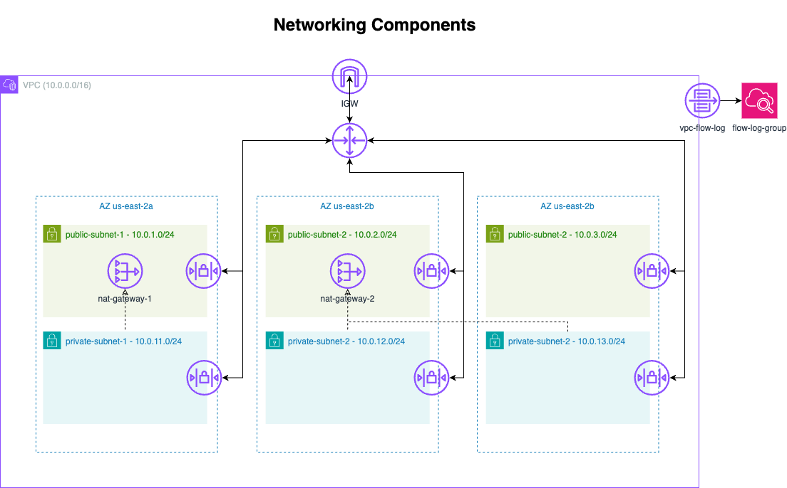

# Developer Notes

- You have to request access for the bedrock models used in the project in the region you're intended to deploy it
- The backend configuration (`backend.tf`) is **not committed** to version control. Each developer should create their own `backend.tf` or use CLI flags for backend settings.
- The AWS provider uses variables for `region` and `profile`. You can set these via:
  - CLI:
    `terraform plan -var="aws_profile=your_profile" -var="aws_region=us-east-2"`
  - Environment variables (before running any terraform cli command):
    `export AWS_PROFILE=your_profile`
    `export AWS_REGION=us-east-2`
- If `aws_profile` is not set, Terraform will use your default AWS CLI profile.
- Create a `local.auto.tfvars` and fill it based on the [variables.tf](variables.tf) file.
- Update the [vpc.tf](vpc.tf) file based on the region you're intended to use
- Run export AWS_ACCESS_KEY_ID=<ci_principal_arn access-key> && export AWS_SECRET_ACCESS_KEY=<ci_principal_arn secret> in terminal before run any terraform command

## Networking Architecture

The diagram below illustrates the networking components provisioned by the infrastructure code. While networking is not the main focus of this repository, it demonstrates production-grade VPC design and AWS best practices.

<!-- BEGIN_TF_DOCS -->
## Requirements

| Name | Version |
|------|---------|
|  [archive](#requirement\_archive) | ~> 2.0 |
|  [aws](#requirement\_aws) | ~>5.0 |
|  [awscc](#requirement\_awscc) | = 1.35.0 |
|  [opensearch](#requirement\_opensearch) | 2.2.0 |
|  [time](#requirement\_time) | ~> 0.6 |

## Providers

| Name | Version |
|------|---------|
|  [archive](#provider\_archive) | 2.7.1 |
|  [aws](#provider\_aws) | 5.99.1 |

## Modules

| Name | Source | Version |
|------|--------|---------|
|  [bedrock](#module\_bedrock) | ./modules/bedrock-components | n/a |
|  [chatbot\_lambda](#module\_chatbot\_lambda) | ./modules/lambda | n/a |
|  [networking](#module\_networking) | ./modules/networking-components | n/a |
|  [observability](#module\_observability) | ./modules/observability-components | n/a |

## Resources

| Name | Type |
|------|------|
| [aws_security_group.lambda_sg](https://registry.terraform.io/providers/hashicorp/aws/latest/docs/resources/security_group) | resource |
| [archive_file.chatbot_lambda](https://registry.terraform.io/providers/hashicorp/archive/latest/docs/data-sources/file) | data source |
| [aws_caller_identity.current](https://registry.terraform.io/providers/hashicorp/aws/latest/docs/data-sources/caller_identity) | data source |
| [aws_region.current](https://registry.terraform.io/providers/hashicorp/aws/latest/docs/data-sources/region) | data source |

## Inputs

| Name | Description | Type | Default | Required |
|------|-------------|------|---------|:--------:|
|  [aws\_profile](#input\_aws\_profile) | AWS CLI profile to use | `string` | `null` | no |
|  [aws\_region](#input\_aws\_region) | AWS region to deploy resources | `string` | `null` | no |
|  [bedrock\_model\_arn](#input\_bedrock\_model\_arn) | ARN of the Bedrock model to use for the chatbot Lambda. | `string` | n/a | yes |
|  [cost\_center](#input\_cost\_center) | The cost center associated with the resources. | `string` | `null` | no |
|  [created\_by](#input\_created\_by) | The arn of the IAM user or role that create the resources | `string` | n/a | yes |
|  [environment](#input\_environment) | The environment for the resources (e.g., dev, staging, prod). | `string` | n/a | yes |
|  [kb\_storage\_type](#input\_kb\_storage\_type) | The storage type of a knowledge base. | `string` | `null` | no |
|  [owner](#input\_owner) | The owner of the resources. | `string` | n/a | yes |
|  [pinecone\_connection\_string](#input\_pinecone\_connection\_string) | The endpoint URL for your index management page. | `string` | `null` | no |
|  [project](#input\_project) | The project name for the resources. | `string` | n/a | yes |

## Outputs

| Name | Description |
|------|-------------|
|  [chatbot\_lambda\_arn](#output\_chatbot\_lambda\_arn) | ARN of the Chatbot Lambda function |
|  [chatbot\_lambda\_function\_name](#output\_chatbot\_lambda\_function\_name) | Name of the Chatbot Lambda function |
|  [nat\_gateway\_ids](#output\_nat\_gateway\_ids) | The IDs of the NAT Gateways |
|  [private\_subnet\_ids](#output\_private\_subnet\_ids) | The IDs of the private subnets |
|  [public\_subnet\_ids](#output\_public\_subnet\_ids) | The IDs of the public subnets |
|  [vpc\_id](#output\_vpc\_id) | The ID of the VPC |
<!-- END_TF_DOCS -->
